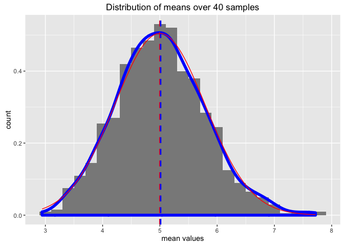
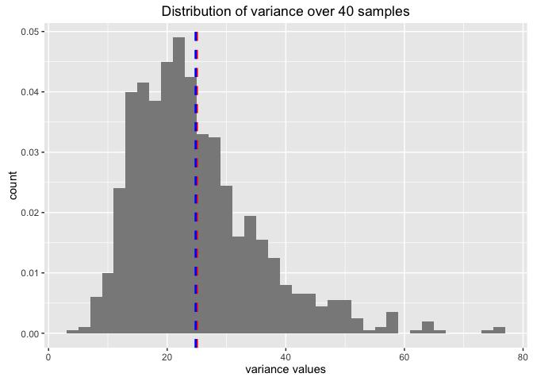

# Statistical Inference Project : Simulation Excercise
Manojkumar Parmar  
10/20/2016  


## Overview

In this report investigation on the **exponential distribution** is performed in R and it is compared with the Central Limit Theorem. As part of report, following aspects are investigated.

- Sample Mean versus Theoretical Mean
- Sample Variance versus Theoretical Variance
- Distribution comparison with normal distribution

---

## Simulations

The exponential distribution can be simulated in R with **rexp(n, lambda)** where lambda ($\lambda$) is the rate parameter. The mean ($\mu$) of exponential distribution is $\frac{1}{\lambda}$ and the standard deviation ($\sigma$) is also $\frac{1}{\lambda}$ (so standard variance ($\sigma^2$) is $\frac{1}{\lambda}^2$). 
Here for all simulation purpose $\lambda = 0.2$ is used.

### Simulation methodology:
In investigation report, average of $40$ samples are considered from exponential distributions. Same procedure is reported over $1000$ times to avoid anomalies.

Here is the example of distribution of exponential distribution samples with $\lambda = 0.2$. Additionally, to prove that theoretical mean of distribution $\frac{1}{\lambda}$, simulation is done with law of large numbers.


```r
n = 1000
lambda = 0.2
#generating exp distribution for 1000 samples
base_data = rexp(n,lambda)
# cumulative mean calculation
means <- cumsum(base_data) / (1  : n)
```


```r
#code for plotting distribution and law of large number
p <- qplot(base_data, geom ='histogram',binwidth = 2,
           main = "Sample Distribution",
      xlab = "Sample value", ylab = "count",
      fill = I("blue"),xlim = c(0,30))
g <- ggplot(data.frame(x = 1 : n, y = means), aes(x = x, y = y))+
        geom_line(size = 1.5)+
        labs(x = "Number of obs", y = "Cumulative mean")+
        geom_hline(yintercept = (1/lambda), colour="#BB0000", 
                    linetype="dashed", size = 2)+
        geom_line(size = 2 )+
        ggtitle("LLN")
grid.arrange(p,g, ncol =2)
```

<!-- -->

In LLN figure, red dashed line represents the theoretical mean $\frac{1}{\lambda} = \frac{1}{0.2} = 5$. From figure it is clear that exponential distribution mean value approaches theoretical mean as sample size increases.

---

## Analysis of Distribution

For detailed analysis, $40$ samples are derived from exponential distribution having $\lambda = 0.2$. To avoid anomalies in result, $40$ samples are derived $1000$ times and mean of each $40$ sample is stored for further analysis.


```r
nsim = 1000 #repeatation number of experiment

n = 40 #number of samples
lambda= 0.2 #lambda property of exponential distribution

mnsexp = NULL #mean values from every time 40 samples are drawn
varexp = NULL #variance value from every time 40 samples are drawn
thmean = 1/lambda # theoratical mean
thmean
```

```
## [1] 5
```

```r
thsd = 1/lambda #theratical standard deviation for large samples
thssd = thsd/sqrt(n) # theoratical standard deviation for 40 samples
thsd
```

```
## [1] 5
```

```r
thvar = 1/lambda^2 #theoratical variance for large
thsvar = thvar/n #theoratical variance for 40 samples
thvar
```

```
## [1] 25
```

```r
#generate mean and variane distributio
for (i in 1:nsim) {
        samples = rexp(n,lambda)
        mnsexp = c(mnsexp,mean(samples))
        varexp = c(varexp,var(samples))
}
```

- Theoretical mean of exponential distribution is $5$ derived using  $\frac{1}{\lambda}$.
- Theoretical standard deviation of exponential distribution is $5$ for large samples and $0.7905694$ with sample size of $40$ derived using $\frac{1/\lambda}{\sqrt[2]{n}}$.
- Theoretical variance of exponential distribution is $25$ for large samples and $0.625$ with sample size of $40$ derived using $\frac{1/\lambda^2}{n}$.

### Sample Mean versus Theoretical Mean

Following figure represents distribution of obtained mean over $1000$ trials of $40$ samples of exponential distribution. 
Dashed blue lines represents the obtained mean from samples and dashed red line represents the theoretical mean.
Blue line envelope represents the obtained distribution while red line represents the normal distribution with mean $5$ and standard deviation $5$.


```r
#code for plotting mean distribution
p <- ggplot(data.frame(x = mnsexp),aes(x=x)) + 
        geom_histogram(aes(y = ..density..),binwidth = 0.2,fill=I('#8A8A8A')) + 
        geom_density(colour = 'blue', size = 2) +
        ggtitle("Distribution of means over 40 samples") +
        labs(x="mean values", y ="count") +
        geom_vline(xintercept = thmean, colour="red", 
                   linetype="dashed", size = 1)+
        geom_vline(xintercept = mean(mnsexp), colour="blue", 
                   linetype="dashed", size = 1)+
        stat_function(fun = dnorm, args = list(mean = thmean , sd = thssd), 
                      colour = "red")
        
p
```

<!-- -->

From above figure it can be concluded that observed mean follows closely the normal distribution.

### Sample Variance versus Theoretical Variance

Following figure represents distribution of obtained variances over $1000$ trials of $40$ samples of exponential distribution. 
Dashed blue lines represents the obtained mean of variances from samples  and dashed red line represents the theoretical variance.


```r
#code for plotting variance distribution
q <- ggplot(data.frame(x = varexp),aes(x)) + 
        geom_histogram(aes(y = ..density..),binwidth = 2,fill=I('#8A8A8A')) + 
        ggtitle("Distribution of variance over 40 samples") +
        labs(x="variance values", y ="count") +
        geom_vline(xintercept = thvar, colour="red", 
                   linetype="dashed", size = 1)+
        geom_vline(xintercept = mean(varexp), colour="blue", 
                   linetype="dashed", size = 1)
q
```

<!-- -->

From above figure it can be concluded that observed variances follows normal distribution around theoretical variance.

### Distribution comparision with normal distribution

#### Graphical way
From sample means and sample variance analysis it is graphically clear that distribution follows normal distribution. 

#### Mathematical : Using Sample Coverage
However, mathematical properties with respect to standard deviations can be used to prove that distribution is normal.
Note that for standard normal distribution, approximately $68\%$, $95\%$ and $99\%$  of the normal density lies within $1$, $2$ and $3$ standard deviations from the mean, respectively.

Following R function samplecoverage is written to analyse the property of standard normal with respect to coverage of samples corresponding to standard deviation. 


```r
# function to calculate sample coverage for given standard distribution
samplecoverage <- function(sample, nsd){
        #sample - sample of data
        #nsd - no. of standard deviation (always >= 0)
        smean = mean(sample) #mean of samples
        ssd =sd(sample) # sd of samples
        ul = smean + nsd * ssd # calculate lower limit for given sd
        ll = smean - nsd * ssd # calculate uper limit for given sd
        coverage = sample > ll & sample < ul # calculate samples falling in limits
        round((sum(coverage) / length(sample))*100,2) # return percentage coverage
}
```

By using above function, following code finds coverage for $1^{st}$, $2^{nd}$ and $3^{rd}$ standard deviation.


```r
# code to generate sample coverage for 1,2 and 3 standardd deviations
for (i in  1:3){
       print(paste0("Coverage for ",i," standard deviation = ", 
                    samplecoverage(mnsexp,i), "%"))
}
```

```
## [1] "Coverage for 1 standard deviation = 69.6%"
## [1] "Coverage for 2 standard deviation = 95%"
## [1] "Coverage for 3 standard deviation = 99.6%"
```

From analysis of sample coverage, it is clear that generated distribution follows the normal distribution.

#### Mathematical : Using quantiles

Additionally, quantiles comparison with normal distribution is carried out using following code.


```r
qqnorm(mnsexp,main ="Quantile relation Plot", 
       xlab = "Normal Distribution Quantiles",
       ylab = "Exponential sample Quantiles")
qqline(mnsexp,col = "2")
```

<!-- -->

From analysis of the figure it is evident that distribution is following normal distribution quntiles linearly.

#### Conclusion
Hence using graphical way, using sample coverage way and by comparison of quantile relation ship it is safe to conclude that exponential distribution is approximately normal.

---
