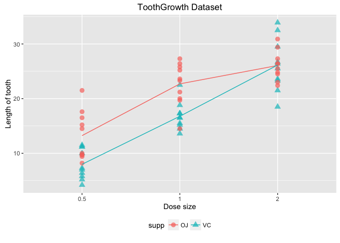
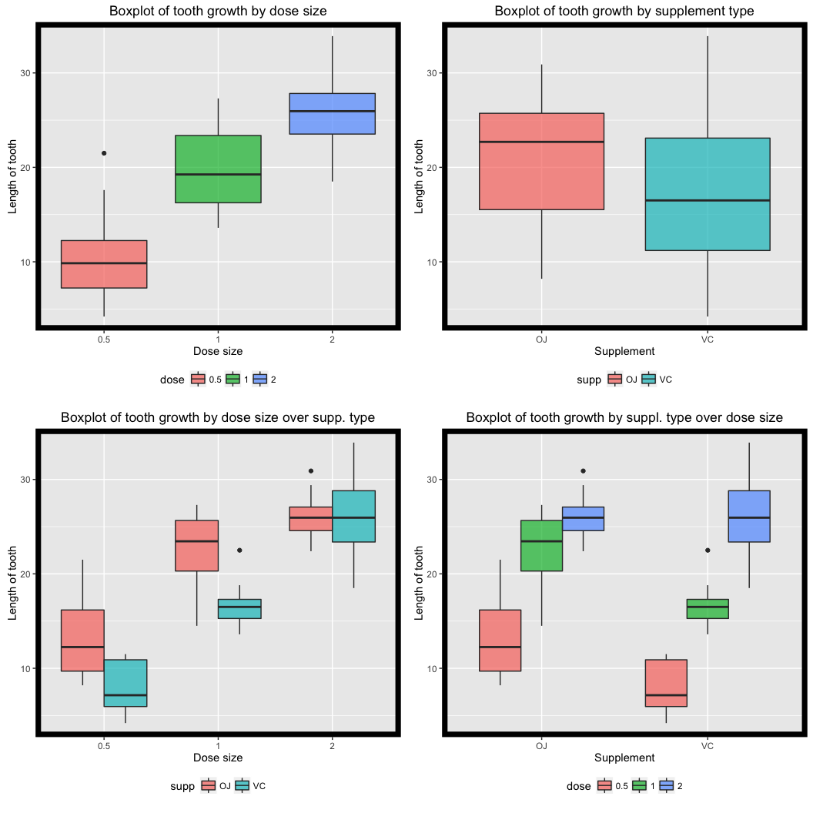

# Statistical Inference Project : ToothGrowth Data Analysis
Manojkumar Parmar  
10/20/2016  


## Overview
In this report investigation on the **ToothGrowth** data set is performed in R and various hypothesis are derived and tested with respect to dosage size and supplement type. 

## Dataset

Data set is available with r package "datasets". Following code loads the data set and provides statistical summary of data set.

```r
library(datasets)
data("ToothGrowth")
stat.desc(ToothGrowth)
```

```
##                       len supp        dose
## nbr.val        60.0000000   NA 60.00000000
## nbr.null        0.0000000   NA  0.00000000
## nbr.na          0.0000000   NA  0.00000000
## min             4.2000000   NA  0.50000000
## max            33.9000000   NA  2.00000000
## range          29.7000000   NA  1.50000000
## sum          1128.8000000   NA 70.00000000
## median         19.2500000   NA  1.00000000
## mean           18.8133333   NA  1.16666667
## SE.mean         0.9875223   NA  0.08118705
## CI.mean.0.95    1.9760276   NA  0.16245491
## var            58.5120226   NA  0.39548023
## std.dev         7.6493152   NA  0.62887219
## coef.var        0.4065901   NA  0.53903330
```

### Visualization of data
Plotting the data of data set provides visualization to improve understanding of data. Following code plots the data samples separated by supplement over dose size.

```r
# converting doses to factor for plotting
ToothGrowth$dose <- factor(ToothGrowth$dose)
#plotting of raw data
g0 <- ggplot(ToothGrowth, aes(x = dose, y = len, color = supp, shape = supp)) + 
        geom_point(alpha=0.7 , size = 3) + theme(legend.position="bottom")  +
        geom_line(data=aggregate(len~.,data=ToothGrowth,mean),aes(group=supp,colour=supp)) +
        ggtitle("ToothGrowth Dataset") + 
        labs(y = "Length of tooth", x = "Dose size")
g0
```

<!-- -->

Following code provides detailed visualization of key summary statistics of data with box plot.

```r
#boxplot of data dose wise
g1 <- ggplot(ToothGrowth, aes(x = dose, y = len, fill = dose)) + 
        geom_boxplot(alpha=0.7)+ theme(legend.position="bottom",
                                       panel.border = element_rect(colour = "black", 
                                                                   fill=NA, size=5))+
        ggtitle("Boxplot of tooth growth by dose size") + 
        labs(y = "Length of tooth", x = "Dose size")
#boxplot of data supplement wise
g2 <- ggplot(ToothGrowth, aes(x = supp, y = len, fill = supp)) + 
        geom_boxplot(alpha=0.7) + theme(legend.position="bottom",
                                        panel.border = element_rect(colour = "black", 
                                                                    fill=NA, size=5))+
        ggtitle("Boxplot of tooth growth by supplement type") + 
        labs(y = "Length of tooth", x = "Supplement")
#two box plot of data supplement wise and dose wise
g3 <- ggplot(ToothGrowth, aes(x = supp, y = len, fill = dose)) + 
        geom_boxplot(alpha=0.7) + theme(legend.position="bottom",
                                        panel.border = element_rect(colour = "black", 
                                                                    fill=NA, size=5))+
        ggtitle("Boxplot of tooth growth by suppl. type over dose size") + 
        labs(y = "Length of tooth", x = "Supplement")
g4 <- ggplot(ToothGrowth, aes(x = dose, y = len, fill = supp)) + 
        geom_boxplot(alpha=0.7) + theme(legend.position="bottom",
                                        panel.border = element_rect(colour = "black", 
                                                                    fill=NA, size=5))+
        ggtitle("Boxplot of tooth growth by dose size over supp. type") + 
        labs(y = "Length of tooth", x = "Dose size")
grid.arrange(g1,g2,g4,g3,ncol=2)
```

<!-- -->


### Summary of dataset
In this chapter, detailed summary of data set is presented by various means.

- Sample sizes over various dose sizes and supplement

```r
#sample count dose vise and supplement wise
with(ToothGrowth,table(supp, dose))
```

```
##     dose
## supp 0.5  1  2
##   OJ  10 10 10
##   VC  10 10 10
```

- Mean and standard deviation of samples based on dose size

```r
# mean and sd of samples dose wise
with(ToothGrowth,tapply(len, dose, mean))
```

```
##    0.5      1      2 
## 10.605 19.735 26.100
```

```r
with(ToothGrowth,tapply(len, dose, sd))
```

```
##      0.5        1        2 
## 4.499763 4.415436 3.774150
```

- Mean and standard deviation of samples based on supplement type

```r
# mean and sd of samples supplement wise
with(ToothGrowth,tapply(len, supp, mean))
```

```
##       OJ       VC 
## 20.66333 16.96333
```

```r
with(ToothGrowth,tapply(len, supp, sd))
```

```
##       OJ       VC 
## 6.605561 8.266029
```

- Mean and standard deviation of samples based on dose size and supplement type.

```r
# mean and sd of samples dose wise & supplement wise
with(ToothGrowth,tapply(len, list(supp,dose), mean))
```

```
##      0.5     1     2
## OJ 13.23 22.70 26.06
## VC  7.98 16.77 26.14
```

```r
with(ToothGrowth,tapply(len, list(supp,dose), sd))
```

```
##         0.5        1        2
## OJ 4.459709 3.910953 2.655058
## VC 2.746634 2.515309 4.797731
```

---

## Hypothesis

Based on data visualization and summary of data, there are certain observations to be made.

- Dose increase seems to increase teeth growth ( refer above "Box plot of tooth growth by dose size")
- OJ supplement seems to have positive impact on teeth growth (refer above "Box plot of tooth growth by supplement type")
- Dose wise, OJ supplement seems to have positive impact on teeth growth (refer "Box plot of tooth growth by suppl. type over dose size")

However, this observation needs to be validated by statistical tools. Here, hypothesis testing is used with $95$% confidence interval for t distribution.
In following sections, hypothesis testing is carried out by preparing necessary data set and later subjecting the data set for t-test. At the end, summary of hypothesis testing is provided.

### H1 : Dose increase have positive impact on teeth growth

#### Dataset preparation

Following code, generates dose wise data set independent of supplement type.


```r
#Dose wise seperation
d05 <- subset(ToothGrowth,dose==0.5,select = c(len,dose))
stat.desc(d05)
d10 <- subset(ToothGrowth,dose==1.0,select = c(len,dose))
stat.desc(d10)
d20 <- subset(ToothGrowth,dose==2.0,select = c(len,dose))
stat.desc(d20)
```

#### Hypothesis testing

To prove the hypothesis, 3 tests are carried out over dose size.


```r
#1 : Dose increase have impact on teeth growth
testd10vsd05 = t.test(d10$len,d05$len,paired = F,var.equal = F)
testd10vsd05
```

```
## 
## 	Welch Two Sample t-test
## 
## data:  d10$len and d05$len
## t = 6.4766, df = 37.986, p-value = 1.268e-07
## alternative hypothesis: true difference in means is not equal to 0
## 95 percent confidence interval:
##   6.276219 11.983781
## sample estimates:
## mean of x mean of y 
##    19.735    10.605
```

```r
testd20vsd05 = t.test(d20$len,d05$len,paired = F,var.equal = F)
testd20vsd05
```

```
## 
## 	Welch Two Sample t-test
## 
## data:  d20$len and d05$len
## t = 11.799, df = 36.883, p-value = 4.398e-14
## alternative hypothesis: true difference in means is not equal to 0
## 95 percent confidence interval:
##  12.83383 18.15617
## sample estimates:
## mean of x mean of y 
##    26.100    10.605
```

```r
testd20vsd10 = t.test(d20$len,d10$len,paired = F,var.equal = F)
testd20vsd10
```

```
## 
## 	Welch Two Sample t-test
## 
## data:  d20$len and d10$len
## t = 4.9005, df = 37.101, p-value = 1.906e-05
## alternative hypothesis: true difference in means is not equal to 0
## 95 percent confidence interval:
##  3.733519 8.996481
## sample estimates:
## mean of x mean of y 
##    26.100    19.735
```

- All the confidence interval are above $0$ and p-values are less than $0.05$.
- Hence test successfully rejected null hypothesis, i.e. dose size have positive impact on teeth growth.

### H2 : OJ supplement have impact on teeth growth compare to VC supplement

#### Dataset preparation

Following code, generates supplement wise data set independent of dose size.


```r
#supplement wise seperation
oj <- subset(ToothGrowth,supp=="OJ",select = c(len,dose))
stat.desc(oj)
vc <- subset(ToothGrowth,supp=="VC",select = c(len,dose))
stat.desc(vc)
```

#### Hypothesis testing

To prove the hypothesis, one test is carried out over supplement type.


```r
#2 : OJ supplement have impact on teeth growth
testojvsvc = t.test(oj$len,vc$len, paired = F, var.equal = F)
testojvsvc
```

```
## 
## 	Welch Two Sample t-test
## 
## data:  oj$len and vc$len
## t = 1.9153, df = 55.309, p-value = 0.06063
## alternative hypothesis: true difference in means is not equal to 0
## 95 percent confidence interval:
##  -0.1710156  7.5710156
## sample estimates:
## mean of x mean of y 
##  20.66333  16.96333
```

- The confidence interval are inclusive of $0$ and p-values is higher than $0.05$.
- Hence test failed to reject null hypothesis i.e. OJ supplement does not have positive impact on teeth growth in comparison of VC supplement.

#### Additional Hypothesis Testing using Multiple Test rule

In previous testing, we have found that H2 (OJ supplement have impact on teeth growth compare to VC supplement) is failing with very small p-values. To confirm the same, new approch of multiple testing is used here. 

OJ and VC dataset have $30$ samples each. In multiple testing,procedure will choose $21$ samples ($70$%) randomly and perform the test. Randomized trials are repeated for 20 times. On generated p-values then "BH" correction is applied to determine the hypothesis.


```r
repeatTrial = 20 # No. Of repeated trials
pVal=NULL # to store p-value of each trial
ssize = 21 # 70% of 30
for (i in 1:repeatTrial){
        ojs = sample(oj$len ,ssize)
        vcs = sample(vc$len ,ssize)
        ttest = t.test(ojs,vcs,paired = F, var.equal = F)
        pVal = c(pVal,ttest$p.value)
}

sum(pVal < 0.05)
```

```
## [1] 4
```

```r
sum(p.adjust(pVal,method = "BH") < 0.05)
```

```
## [1] 0
```

- All multiple test failes to produce p-values less than $0.5$, 
- Hence, test fails to reject H2 comprehencively.

### H3 : Dose wise, OJ supplement have impact on teeth growth

#### Dataset preparation

Following code, generates supplement wise and dose size wise data set.


```r
#supplement and dosewise seperation
ojd05 <- oj[oj$dose==0.5,]$len
stat.desc(ojd05)
ojd10 <- oj[oj$dose==1.0,]$len
stat.desc(ojd10)
ojd20 <- oj[oj$dose==2.0,]$len
stat.desc(ojd20)
vcd05 <- vc[vc$dose==0.5,]$len
stat.desc(vcd05)
vcd10 <- vc[vc$dose==1.0,]$len
stat.desc(vcd10)
vcd20 <- vc[vc$dose==2.0,]$len
stat.desc(vcd20)
```

#### Hypothesis testing

To prove the hypothesis, 3 tests are carried out by dose wise over supplement type.


```r
# 3 : dose wise, OJ supplement have impact on teeth grwoth
testojd05vsvcd05 = t.test(ojd05,vcd05,paired = F, var.equal = F)
testojd10vsvcd10 = t.test(ojd10,vcd10,paired = F, var.equal = F)
testojd20vsvcd20 = t.test(ojd20,vcd20,paired = F, var.equal = F)
```

1. Dose of 0.5, OJ supplement verses VC supplement t test result


```
## 
## 	Welch Two Sample t-test
## 
## data:  ojd05 and vcd05
## t = 3.1697, df = 14.969, p-value = 0.006359
## alternative hypothesis: true difference in means is not equal to 0
## 95 percent confidence interval:
##  1.719057 8.780943
## sample estimates:
## mean of x mean of y 
##     13.23      7.98
```

- All the confidence interval are above $0$ and p-values are less than $0.05$.
- Hence test successfully rejected null hypothesis, i.e. OJ supplement does have positive impact on teeth growth in comparison of VC supplement for $0.5$ dose size.

2. Dose of 1.0, OJ supplement verses VC supplement t test result


```
## 
## 	Welch Two Sample t-test
## 
## data:  ojd10 and vcd10
## t = 4.0328, df = 15.358, p-value = 0.001038
## alternative hypothesis: true difference in means is not equal to 0
## 95 percent confidence interval:
##  2.802148 9.057852
## sample estimates:
## mean of x mean of y 
##     22.70     16.77
```

- All the confidence interval are above $0$ and p-values are less than $0.05$.
- Hence test successfully rejected null hypothesis, i.e. OJ supplement does have positive impact on teeth growth in comparison of VC supplement for $1.0$ dose size
     
3. Dose of 2.0, OJ supplement verses VC supplement t test result


```
## 
## 	Welch Two Sample t-test
## 
## data:  ojd20 and vcd20
## t = -0.046136, df = 14.04, p-value = 0.9639
## alternative hypothesis: true difference in means is not equal to 0
## 95 percent confidence interval:
##  -3.79807  3.63807
## sample estimates:
## mean of x mean of y 
##     26.06     26.14
```

- The confidence interval are inclusive of $0$ and p-values is higher than $0.05$.
- Hence test failed to reject null hypothesis i.e. OJ supplement does not have positive impact on teeth growth in comparison of VC supplement for $2.0$ dose size.

### Summary of Hypothesis Testing

- From H1 : Dose increase **have strong positive impact** on teeth growth.
     - p-value for $1.0$ over $0.5$ =  $1.2683007\times 10^{-7}$
     - p-value for $2.0$ over $0.5$ =  $4.397525\times 10^{-14}$
     - p-value for $2.0$ over $1.0$ =  $1.9064295\times 10^{-5}$
     - All p-values are less than $0.05$ & hence strong influence

- From H2 : OJ supplement **does not have stronger impact** on teeth growth as p-value $0.0606345$ is which is higher than $0.05$. Multiple test procedure fails in same context and leads to same conclusion.

- From H3 : Does wise, OJ supplement **have strong impact** on teeth growth for dose size $0.5$ and $1.0$. For dose $2.0$, OJ supplement **does not have impact** on teeth growth.
     - p-values for $0.5$ dose for OJ over VC = $0.0063586$
     - p-values for $1.0$ dose for OJ over VC = $0.0010384$
     - p-values for $2.0$ dose for OJ over VC = $0.9638516$
     - For dose $0.5$ and $1.0$ p-values are lower than $0.05$ and hence strong positive influence
     - For dose $2.0$ p-value is much more higher than $0.05$and hence no impact.

## Conclusion
Increase in dose leads to increase in growth of teeth irrespective of supplement method. OJ supplement method is not really superior over all dose ranges. However, for small dose ranges up to $1.0$, OJ supplement is highly superior over VC supplement. 


## Assumptions
1. A higher value of “len” indicates a higher impact.
2. Higher value of “dose” indicates increased dose size.
3. Data provided is independently distributed and not paired.
4. Data follows T distribution as the observations are limited.
5. Data is derived from samples representative of the population. 
6. Variances are considered to be unequal.
7. Confidence interval of $95$% is used for hypothesis test.
